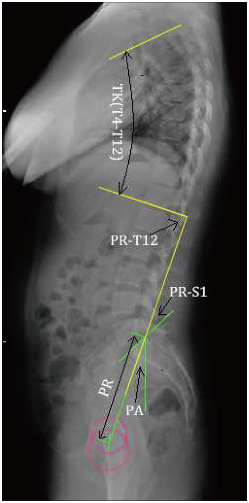

# Introduction

For the prototype, we have simulated various motion sensors, which are capable of capturing movement data of patient accurately.
With the data captured, it is possible to provide analytics to the health care provider in order to aid them in the diagnosis and treatment.
This notebook is to explore and validate the same idea. We work with the [Biomechanical features of Orthopedic patients](https://www.kaggle.com/datasets/uciml/biomechanical-features-of-orthopedic-patients) dataset.
The task involves classifying patients as belonging to one out of three categories: Normal (100 patients), Disk Hernia (60 patients) or Spondylolisthesis (150 patients).

# TLDR
Please see [this link]() for demo of EHR Analytics  

# Dataset
Each patient is represented in the data set by six biomechanical attributes derived from the shape and orientation of the pelvis and lumbar spine.

**Specifically**:
|Variable| Definition | Normal Range |
| :---: | :---: | :---: |
|Pelvic Incidence|Angle between the line perpendicular to the sacral plate at its midpoint and the line connecting this point to the femoral heads axis.| Pelvic incidence can vary from 33° to 85° in the normal population.
|Pelvic Tilt| Angle created by a line running from the sacral endplate midpoint to the center of the bifemoral heads and the vertical axis.| The average ranges of anterior and posterior pelvic tilting are 13.0 ± 4.9°, and 8.9 ± 4.5°, respectively.
|Lumbar Lordosis Angle| Angle between the upper plane of the L1 lumbar vertebrae and the upper plane of the S1 sacral vertebrae.| Normal lordosis (NL) is in the 31–50° range
|Sacral Slope|Angle of the sacral plateau to the horizontal. |The normal range of value for the sacral slope was from 32° to 49°
|Pelvic Radius|The distance from the hip axis to the posterior-superior corner of the S1 endplate.| Normal Range falls in 133.0±9.6 mm|
|Grade of Spondylolisthesis|Spondylolisthesis is a spinal disorder in which a bone (vertebra) slips forward onto the bone below it.| The seriousness of the disorder is marked by grade values



# Files
Train.ipynb: To train the ML Model.
Predict.py: To test on external data.
model.pkl: State of model saved in pickle format for testing purposes.
scaler.pkl: State of data preprocessor saved in pickle format for testing purpose

# Training
To train the machine learning model. Please perform Restart & Run All on Train.ipynb. This step creates two pickle files. Namely,
 - model.pkl
 - scaler.pkl

# Testing
To use the model for commercial / testing purposes. 
```python predict.py```
And then enter the patient data.
